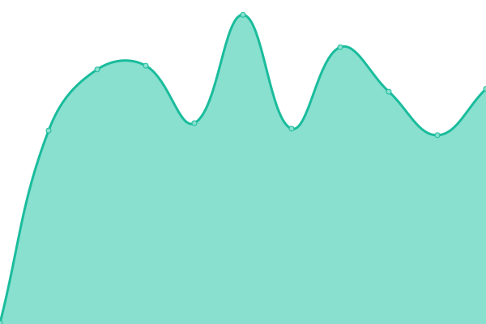
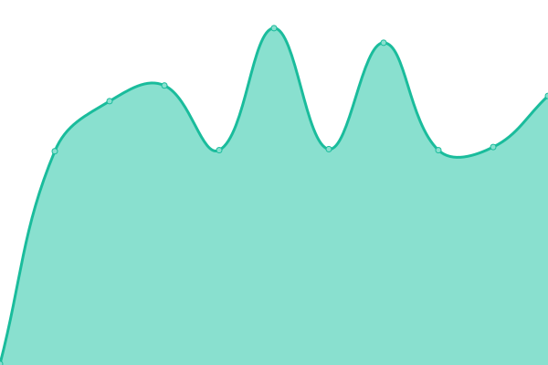

# [📈 Live Status](https://demo.upptime.js.org): <!--live status--> **🟩 All systems operational**

This repository contains the open-source uptime monitor and status page for [kaiyu](https://demo.upptime.js.org), powered by [Upptime](https://github.com/upptime/upptime).

With [Upptime](https://upptime.js.org), you can get your own unlimited and free uptime monitor and status page, powered entirely by a GitHub repository. We use [Issues](https://github.com/kayryu/status/issues) as incident reports, [Actions](https://github.com/kayryu/status/actions) as uptime monitors, and [Pages](https://demo.upptime.js.org) for the status page.

<!--start: status pages-->
<!-- This summary is generated by Upptime (https://github.com/upptime/upptime) -->
<!-- Do not edit this manually, your changes will be overwritten -->
<!-- prettier-ignore -->
| URL | Status | History | Response Time | Uptime |
| --- | ------ | ------- | ------------- | ------ |
|  [BoolScan](https://boolscan.com) | 🟩 Up | [bool-scan.yml](https://github.com/Kayryu/status/commits/HEAD/history/bool-scan.yml) | 

 711ms
     
 | 

<a href="https://Kayryu.github.io/status/history/bool-scan">100.00%</a>
    

|  [BoolSwap](https://boolswap.com) | 🟩 Up | [bool-swap.yml](https://github.com/Kayryu/status/commits/HEAD/history/bool-swap.yml) | 

 772ms
     
 | 

<a href="https://Kayryu.github.io/status/history/bool-swap">100.00%</a>
    

|  [BOOL Apps](https://apps.bool.network) | 🟩 Up | [bool-apps.yml](https://github.com/Kayryu/status/commits/HEAD/history/bool-apps.yml) | 

 932ms
     
 | 

<a href="https://Kayryu.github.io/status/history/bool-apps">100.00%</a>
    

|  [Alpha Net WS endpoint](alpha-rpc-node-ws.bool.network) | 🟩 Up | [alpha-net-ws-endpoint.yml](https://github.com/Kayryu/status/commits/HEAD/history/alpha-net-ws-endpoint.yml) | 

 253ms
     
 | 

<a href="https://Kayryu.github.io/status/history/alpha-net-ws-endpoint">100.00%</a>
    

|  [Alpha Net HTTP endpoint](alpha-rpc-node-http.bool.network) | 🟩 Up | [alpha-net-http-endpoint.yml](https://github.com/Kayryu/status/commits/HEAD/history/alpha-net-http-endpoint.yml) | 

 244ms
     
 | 

<a href="https://Kayryu.github.io/status/history/alpha-net-http-endpoint">100.00%</a>
    

|  [Test Net WS endpoint](test-rpc-node-ws.bool.network) | 🟩 Up | [test-net-ws-endpoint.yml](https://github.com/Kayryu/status/commits/HEAD/history/test-net-ws-endpoint.yml) | 

 244ms
     
 | 

<a href="https://Kayryu.github.io/status/history/test-net-ws-endpoint">100.00%</a>
    

|  [Test Net HTTP endpoint](test-rpc-node-http.bool.network) | 🟩 Up | [test-net-http-endpoint.yml](https://github.com/Kayryu/status/commits/HEAD/history/test-net-http-endpoint.yml) | 

 236ms
     
 | 

<a href="https://Kayryu.github.io/status/history/test-net-http-endpoint">100.00%</a>
    

<!--end: status pages-->

[**Visit our status website →**](https://demo.upptime.js.org)

## 📄 License

- Powered by: [Upptime](https://github.com/upptime/upptime)
- Code: [MIT](./LICENSE) © [kaiyu](https://demo.upptime.js.org)
- Data in the `./history` directory: [Open Database License](https://opendatacommons.org/licenses/odbl/1-0/)
